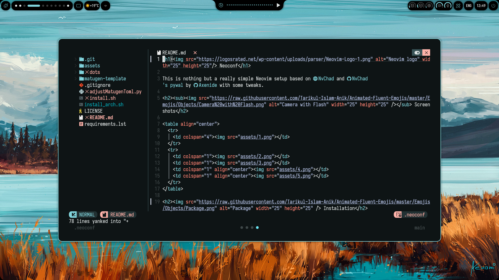

# Neoconf

This is nothing but a really simple Neovim setup based on [NvChad](https://nvchad.com/) and [NvChad's pywal](https://github.com/NvChad/pywal) by [Axenide](https://github.com/Axenide) with some tweaks.

<h2><sub></sub> Screenshots</h2>

<table align="center">
  <tr>
    <td colspan="4"></td>
  </tr>
  <tr>
    <td colspan="1"></td>
    <td colspan="1"></td>
    <td colspan="1" align="center"></td>
    <td colspan="1" align="center"></td>
  </tr>
</table>

## Installation

> [!WARNING]
> For some reason it is pretty common to get an error due to base46 not cloning correctly all the resources needed. In case you get an error regarding some missing files from base64 just rerun the installation script / follow the guide again.

> [!NOTE]
> Both the scripts will use stow, so they won't copy the files to your ~/.config folder, they will only create symlinks to the files inside the cloned repo, so make sure not to delete it after the installation (unless you want to manually copy the files).

> [!NOTE]
> You can pass `-s -- <install_directory>` to the script to change the default install directory (`~/neoconf`)

<h3> On Arch Linux</h3>

On Arch Linux you'll only need to run the installation script, as it'll do everything for you. It'll backup the files automatically to `<path/to/the/file>.bkp` and it will automatically install all the required packages.

```bash
curl -fsSL https://raw.githubusercontent.com/Xitonight/neoconf/main/install_arch.sh | bash
```

<h3> On other distros</h3>

Make sure you have installed all the required packages, else the script won't work.
All the packages should be available on your Linux package manager, so install them like you would install any other package.

- [GNU stow](https://www.gnu.org/software/stow/)
- [swww](https://github.com/LGFae/swww)
- [npm](https://www.npmjs.com), (i'd suggest to install npm through the usage of [node version manager](https://github.com/nvm-sh/nvm))
- [matugen](https://github.com/InioX/matugen) 
- [python-watchdog](https://pypi.org/project/watchdog/)
- [python-toml]( https://pypi.org/project/toml/ )
- [pywal](https://github.com/dylanaraps/pywal) 

Once every package has been installed, run the script:

```bash
curl -fsSL https://raw.githubusercontent.com/Xitonight/neoconf/main/install.sh | bash
```

## Usage

Now that everything's installed, every time you run `matugen image <path_to_your_wallpaper>` you'll see that neovim will use a fresh new color scheme based on your wallpaper. 

## Uninstalling

Run these commands:

```bash
rm -rf ~/.config/nvim
rm -rf ~/.local/share/nvim
rm -rf ~/.local/state/nvim
rm -rf ~/.config/matugen/templates/colors-pywal
```

And uninstall the packages, that's it.

If you need any help feel free to open an issue or to contact me directly :)

## Credits

I want to thank [Axenide](https://github.com/Axenide) for this absurdly well done plugin and for all i've learnt from him.
